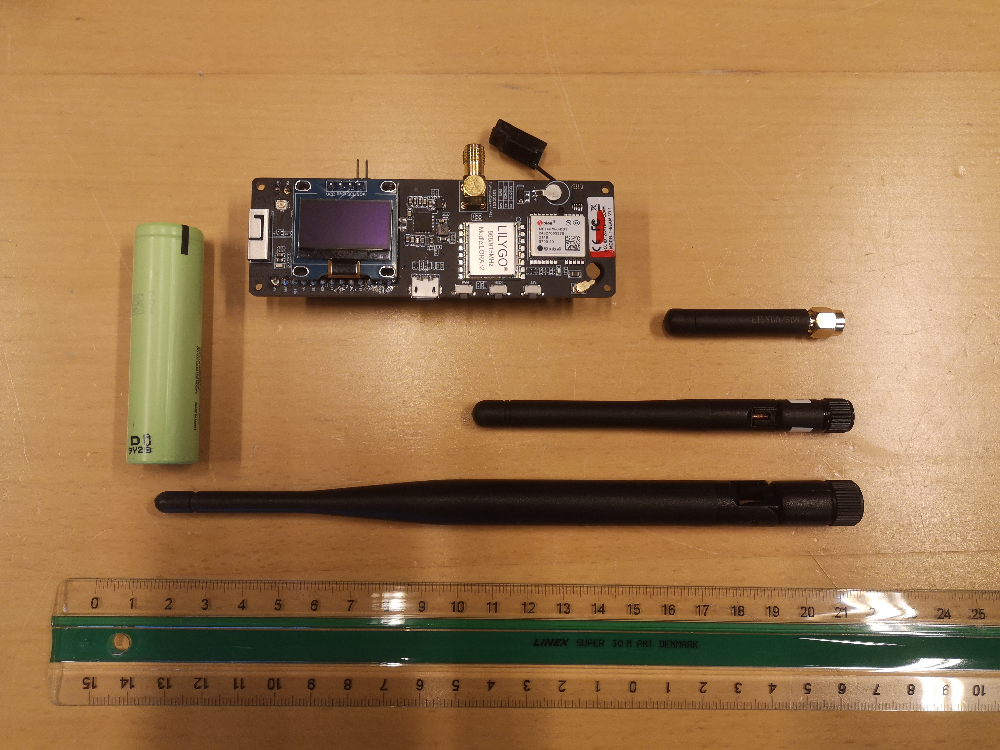

### launch date

no earlier than Oct 21, monday

### flight duration expected
<5 hours, likely 2 - 3 hours

### projected trajectory - to the extent known
Within 300km of HCA International Airport in Beldringe (55.471729434086754, 10.32455297860977)

### attitude control -
None

### antenna
	calculate angle we want
	moxon? - looks interesting!

### maximum weight
	100g

### maximum size
 ~40 x 40 x 15 cm (size of a tall pizza box)
 
### power
	saft batteries or existing psu.

### temperature range expected
	(-20) - (+30) deg Celsius within gondola.

### Weight

T-Beam without battery:31g

Battery (3.7v 18650 LiPo, Temp?): 46g

Antenna, tiny: 4.3g

Antenna, small: 8.1g

Antenna, less small: 20.0g

### Data access:

Make an account on thethingsnetwork.com

Tell Sebastian ot enter your user as a collaborator

Log on an find the project on:
https://cloud.thethings.network

Access through MQTT (each incoming message is sent out to all MQTT subscribers) 

or Webhooks (which are web endpoints - e.g. your own scripts receiving messages and writing to database)

- learn more:

https://www.thethingsindustries.com/docs/integrations/

### Left to do til day X

- finish tracker devices (sebastian)
- optional: setup gateway at airport or close
- prepare ttnmapper.org (if we want to usee that too): make an "experiment" so that we don't poison the terrestrial map

### reading:

https://www.thethingsnetwork.org/article/lorawan-world-record-broken-twice-in-single-experiment-1

https://www.thethingsnetwork.org/article/ground-breaking-world-record-lorawan-packet-received-at-702-km-436-miles-distance

https://www.thethingsnetwork.org/article/lorawan-distance-world-record

https://amateur.sondehub.org/#!mt=Mapnik&mz=5&qm=12h&mc=56.53526,12.91992
